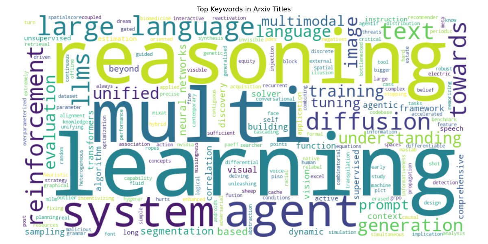

# Machine Learning Trends Report  
**Date:** May 23, 2025  

---

## 1. Introduction

This report summarizes the latest trends in machine learning based on two key sources:

- **Arxiv preprints**: Recent research papers in machine learning (cs.LG, cs.AI, stat.ML)  
- **GitHub trending repositories**: Popular open-source projects focused on ML  

The goal is to identify notable new techniques, models, tools, and patterns in research and community interest.

---

## 2. Key Findings from Arxiv

- **Top trending topics** include:  
  - Large Language Models (LLMs)  
  - Reinforcement Learning  
  - Diffusion Models  
  - Multi-modal Learning  
  - Reasoning Capabilities in models  

- Emerging research focuses on improving reasoning in visual generation, advanced language understanding, and scalable multi-task learning.

---

## 3. Key Findings from GitHub

- Popular repositories reflect community interest in:  
  - Transformer-based models and libraries (e.g., Hugging Face Transformers)  
  - Diffusion model implementations for image and audio generation  
  - Tools for LLM pipelines and retrieval-augmented generation (RAG)  
  - AI applications in quantitative finance (e.g., Microsoft’s Qlib)  
  - ChatGPT prompt engineering and curation  

- High star counts (tens of thousands) indicate strong adoption and active developer engagement.

| Repo Name                     | Stars  | Description                                      | URL                                      |
|-------------------------------|--------|------------------------------------------------|------------------------------------------|
| microsoft/qlib                | 19,833 | AI for quantitative investment                  | https://github.com/microsoft/qlib        |
| f/awesome-chatgpt-prompts     |126,211 | ChatGPT prompt curation                          | https://github.com/f/awesome-chatgpt-prompts |
| pathwaycom/pathway            | 25,332 | ETL for LLM pipelines and analytics             | https://github.com/pathwaycom/pathway    |
| huggingface/transformers      |144,681 | Transformers library for PyTorch, TensorFlow    | https://github.com/huggingface/transformers |
| huggingface/diffusers         | 29,070 | Diffusion models for image, video, audio        | https://github.com/huggingface/diffusers |

---

## 4. Patterns & Trends

- **Research and open-source communities are converging** around large-scale models and their applications.  
- Reinforcement learning and reasoning-enhancement are gaining momentum in both papers and tools.  
- Diffusion models have grown rapidly as a versatile generative approach beyond just images.  
- Tooling for LLM pipelines, especially for real-time and production use cases, is an increasing focus.  
---
## 5. Discord for ML Trends

Recent discussions in leading ML-focused Discord communities emphasize:

- Discord is increasingly popular as a real-time platform for ML researchers and practitioners to connect.  
- Active ML communities on Discord provide instant feedback, collaboration, and sharing of resources.  
- Popular servers include “Machine Learning Official,” “Data Science & AI,” and “ML Research Lounge.”  
- These servers facilitate discussion of latest papers, code repositories, tutorials, and industry news.  
- Discord complements forums and academic platforms by enabling dynamic and informal knowledge exchange.
- Questions related to ethical AI, model interpretibility , and best practices for responsible AI development.
- Curiosity about emerging generative AI applications like diffusion-based image generation and audio synthesis

These interactions hilight a trend towards bridging research advances with real world applications and deployment challenges

---

## 6. Conclusion

The machine learning landscape in 2025 is dominated by:

- Large language and multi-modal models driving new capabilities  
- Strong synergy between academic research and open-source development  
- Rapid evolution of generative models and their deployment tools  
- Growing community engagement on platforms like Discord that accelerate knowledge sharing

These trends suggest promising directions for researchers and practitioners to explore further.

---

*Report generated by automated analysis of Arxiv preprints and GitHub trending repositories.*
